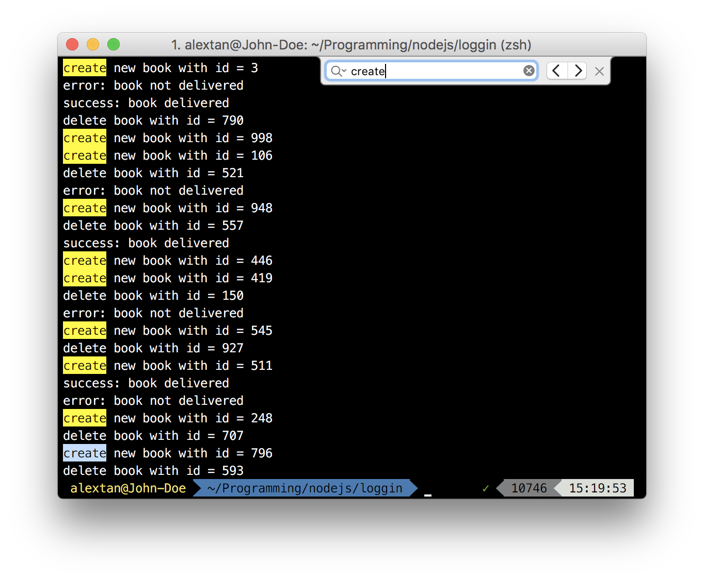
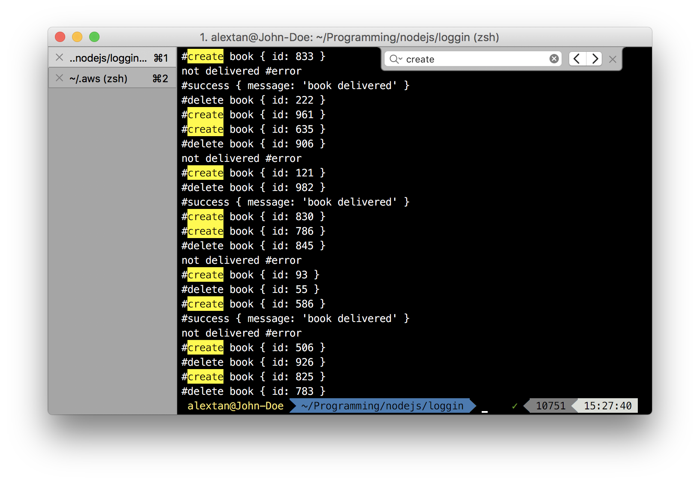

# Logging Data

How can we understand our users more (and their preferences)? In order to do that, we need data.

## Mantra

  Log everything that changes the state, cache every read.

## Logging api calls

For each `session`, associate the user's `id` with the data they are trying to request. This is particularly useful if the api they call is one of the following:

- a search api (keywords, filters, location)
- a recommendation api (suggested places, foods. but what you really want to track is what they `click`)

Let's say the search results will return a list of foods (for simplicity, let's just take the `food_id`). From here on you can ask several questions:

1. What are the similarities between them?
2. What are user's looking for (if you have the description/category of the foods they select, you can do NLP, or similar things to identify the keywords they are most likely to look for)
3. What are the trend in keyword search? (cloudword)
4. What are the most searched foods? (positive)
5. What are the least searched foods? (negative, this is an interesting area - you probably want to look into the trend and suggest them to more relevant parties, or probably enhance them to make it more searchable. Could this be the keyword that most user's want to look for, but fail to get relevant results?).
6. What are the daily/weekly/monthly/yearly search trend?
7. How does the search relates to region/location/country?
8. Can you compute a graph to represent the relationship between the search data and user's profile?

## Tracing onboarding

You have an onboarding screen (login/complete profile) and you would like to track the likelihood they complete the profile (or where they stop, a.k.a. the `pivot point`).
There are several ways to do it, but it involves the following:

1. Determine the starting point, and if the user already enters it
2. Plan the number of steps (if you have 5 steps, each of them contributes to 20% completion)
3. Log the every successful steps, and place them in the corresponding bucket (20%-complete, 40%-complete)
4. If you can log the fields that they do not fill in, you can possibly identify the reason why.
5. As usual, log the user's context to gain more insight on what kind of users will be most likely to complete the flow.
6. Log the time for completion if necessary.


## Tracking Call-to-Actions (CTA) Buttons

A typical mistake would be to just log the event if the user click's the button. You need to log both the number of times displayed and also the feedback.

Given that you have a `Buy this Button`, you need to:

1. Log the number of times the button is displayed (n)
2. Log the actions taken (you can associate it with rewards, `reward=1` if the user clicks, `reward=0` if the user did not click)
3. Possibly the time elapsed (difference in time since display versus clicked). Here we will have an issue with delayed response, especially when the user choose not to click.
4. Compute the ratio of the reward vs number of times displayed.
5. User's context (age, gender, location, etc) is optional for in-depth personalization

So if you displayed the button 100 times, and got 35 clicks, the click ratio will be 0.35. It's up to you to justify whether this is a good value or not.


## Logging vs Monitoring

There are things we want to log (errors, business insights) and monitor (application errors, health check). You need to separate both of them, as logging errors does not add value to business. 
A developer would like to monitor the application (request api calls, errors, cpu/memory usage). 

Business and marketing are only interested to know about the analytics (what are the target audience based on gender, age, location, etc).

## Structured, Semi-structured and Unstructured Logging

There are several ways of logging data - compare the following three different implementations:


### Unstructured Logging


### Structured Logging


### Semi-structured Logging




## Metrics counter

Create a custom metrics collector that sends email/webhook notifications when certain threshold is reached.

```javascript
class Counter {
  constructor () {
    this.events = {}
  }

  register (name, fn, threshold = 100) {
    if (!this.exist(name)) {
      this.events[name] = {
        counter: 0,
        hits: 1,
        fn,
        threshold,
        name
      }
      console.log(`event=${name} registered=true`)
    } else {
      console.log(`Event ${name} has already been initialized`)
    }
  }

  unregister (name) {
    delete this.events[name]
  }

  exist (name) {
    return this.events[name] !== undefined
  }

  increment (name) {
    if (!this.exist(name)) {
      console.log('')
    } else {
      this.events[name].counter += 1
      const { counter, hits, threshold, fn } = this.events[name]
      console.log(counter, threshold * hits)
      if (counter === threshold * hits) {
        this.events[name].hits += 1
        fn && fn(this.events[name])
      }
    }
  }

  info (name) {
    return this.events[name]
  }

  infos () {
    return Object.values(this.events)
  }

  reset (name) {
    this.event[name] = 0
  }
}

const counter = new Counter()
counter.register('send_email', (event) => {
  // console.log('got event', event)
  console.log('Error:', event.name, 'counter=', event.counter)
}, 5)

counter.register('send_to_queue', (event) => {
  console.log(`Error: ${event.name}, count: ${event.counter}`)
}, 20)

Array(100).fill(0).forEach(() => {
  counter.increment('send_email')
  counter.increment('send_to_queue')
})

console.log(counter.infos())
```

## Adding Versioning in Logs

Adding the application version in logs enables you to track the application performance through tags. Do not confuse this with error logs (although it can be added there), but rather metrics logs.

## Quotes

Logs are meant to provide signals, not noises.


## Golang

- setup a logger at the main and pass it down through dependency injection (DI)
- using global logger is not recommended, since you do not want to pollute the global logger
- when passing down the logger through DI, you can customize the logger further (adding name to indicate hierachy, or who the parent function is)
- setting up a logger at init is a no-op (also look at singleton pattern when doing lazy initialization, since lazy initialization is not concurrent-safe), since it makes testing harder
- passing logger in context is a bad design pattern - instead, pass the value you want to have in your logger through context	
- to associate a group of logs (concurrent logging), pass down `requestId` at the start of the region
- logging should be part of a middleware - you should be able to toggle it
- standardize the format of your logging - your logging can include the following
  - level: `info`, `warn`, `debug`, `error` etc. to make it easier to search for events
  - ts: timestamp of the event, in UTC
  - logger: the named logger, usually indicating which subpackage the logger is called from
  - caller: the exact line where the logger is called
  - msg: a human-readable message
  - hostname: the hostname of the application/container, might be useful to check which containers are the one calling the log, especially when you have autoscaling in place
  - requestId: a unique identifier that allows you to group logs together, can be used to trace a sequence of events. Also look at `opentracing` and `opencensus`
  - method: the method name calling the log, can be used to compare performance, especially when you include the application version together
  - took: the duration took in milliseconds
  - semver: the application version, can be used to compare performance, and the changes indicates how often a new deployment is made
  - other parameters: log other parameters such as request params for the method, or errors

Example logs:

```
{"level":"info","ts":1527913244.9135277,"logger":"main.reposvc","caller":"reposvc/model.go:98","msg":"find last created by user","hostname":"c04135e2d167","requestId":"bc91ls78l01krejqmqh0","method":"FindLastCreatedByUser","took":0.023795597,"date":"2015-10-11","default":true}
{"level":"info","ts":1527913245.3131607,"logger":"main.github","caller":"github/model.go:77","msg":"fetch repos cursor","hostname":"c04135e2d167","requestId":"bc91ls78l01krejqmqh0","method":"FetchReposCursor","took":0.399328448,"login":"keryi","start":"2015-10-11","end":"2018-06-02","limit":30,"count":2}
{"level":"info","ts":1527913245.3143008,"logger":"main.reposvc","caller":"reposvc/model.go:42","msg":"inserted repos","hostname":"c04135e2d167","requestId":"bc91ls78l01krejqmqh0","method":"BulkUpsert","took":0.000840333,"count":2}
{"level":"info","ts":1527913245.3148515,"logger":"main.usersvc","caller":"usersvc/model.go:161","msg":"update one user","hostname":"c04135e2d167","requestId":"bc91ls78l01krejqmqh0","method":"UpdateOne","took":0.000388025,"login":"keryi"}
{"level":"info","ts":1527913245.3150039,"logger":"main.mediatorsvc","caller":"mediatorsvc/mediatorsvc.go:117","msg":"got users and upsert users","hostname":"c04135e2d167","requestId":"bc91ls78l01krejqmqh0","method":"FetchRepos","took":45.314477173,"userPerPage":100,"repoPerPage":30,"users":100,"repos":2}
```

## Downside

Logging can reduce the performance of the application significantly. In some benchmark I did with nodejs, the requests per second of a service is cut down by almost half.

However, this does not justify the attempt of not logging in production. For high-performance system, log wisely, but for development/prototype, better to log all the necessary data, then analyse them to identify slow paths

## Visualization
I wanted to do the visualization to display the following:

- function/method calls count (can trace for unused function)
- average function/method latency (performance!)
- function/method health, indicated by the rate of errors per call (SLA and KPI of the service)
- version of the application (e.g. through git SHA, or semver), and the difference compared to the previous version

Would be nice to produce a daily/weekly/monthly report for a service. Also, if you log the application version, you can tell how often you do deployment in a certain time frame.

## Toggle Log

Logging can impact performance, so if you need the extra juice, make sure to turn off your logs. But it is still necessary to log errors for visibility. Consider the following approach:

- only log errors if you do not need the request and response of the service
- consider logging only for a certain period of time (e.g., when the application is first deployed, pass in the env vars for `start_logging_date` and `end_logging_date` for a time frame of, say two weeks. If there are no errors, it will be safely turned off, except for errors.
- make it easier to debug by passing debug flags in application

## Logger as Domain model

I've always misunderstood logs. I usually use the raw log to log out events:

```js
const bunyan = require('bunyan')
// Namespace the logger.
const logger = bunyan.createLogger({name: 'car-service'})
// Add request id for context logging.

class CarService {
  // ctx is always the first parameter.
  create(ctx, car) {
    // do something
    const createdCar = this.repository.create(car)
    const log = logger.child({ ...ctx, request})
    log.info({car}, 'CarCreated')
  }
}
```

Which actually pollutes the classes that depends on the logger with an external dependency (the logger). Instead, I could have defined the logger in a class itself, with the events that I want to log. 

```js
class CarLogger {
  constructor(logger) {
    this.logger = bunyan.createLogger({name: 'car-service'})
  }
  carCreated(ctx, request) {
    log.info({...ctx, request}, 'CarCreated')
  }
}
class CarService {
  constructor(logger) {
    this.logger = logger
  }
  create(ctx, car) {
    // do something
    const createdCar = this.repository.create(car)
    this.logger.carCreated(ctx, car)
  }
}

const carLogger = new CarLogger(require('bunyan'))
const carService = new CarService(carLogger)
carService.create({id: uuid()}, {name: 'Audi'})
```

The errors could be captured once outside of the logger.

```js
const carLogger = new CarLogger(require('bunyan'))
const carService = new CarService(carLogger)
const ctx = {id: uuid()}
try {
  const response = await carService.create(ctx, {name: 'Audi'})
} catch (error) {
  // Every layer has a different logger. The globalLogger is mainly another logger above the car service logger.
  globalLogger.error(ctx, {error: error.message})
}
```

## Logging and events

What if we need our logger to react to the events, rather than the logger logging the events? There a slight difference between this two - reacting to events means the event will be created first, and then the logs will be triggered. Logging the events means the logger explicitly logs the event that happens. We can simply refactor our code from the example above:

```js
class CarEvent {
  constructor() {
    this.map = new Map()
    this.fns = []
  }
  nofity(...fns) {
    for (let fn of fns) {
      if (this.map.has(fn.name)) {
        console.log(`${fn.name} already exist`)
        return
      }
      this.map.set(fn.name, fn)
      console.log(`registered: ${fn.name}`)
      this.fns.push(fn)
    }
  }
  carCreated(ctx, params) {
    for (let fn of this.fns) {
      fn(ctx, params, 'CarCreated')
    }
  }
}
const carEvent = new CarEvent()
// Add the subscribers. E.g. logger, message queue. They must conform to the interface.
function logError(params) {
  console.log('Error:', params)
}
carEvent.nofity(console.log, logError)
const ctx = {
  id: '123'
}
carEvent.carCreated(ctx, {
  name: 'Audi'
})
carEvent.carCreated(ctx, {
  name: 'Mercedes'
})
```

Or a generic dispatcher:
```js
class CarEvent {
  constructor() {
    this.events = new Map()
  }
  on(event, fn) {
    if (!this.events.has(event)) {
      this.events.set(event, [])
    }
    this.events.get(event).push(fn)
  }
  emit(event, params) {
    const events = this.events.get(event)
    if (!events.length) {
      return
    }
    for (let event of events) {
      event(params)
    }
  }
}
const carEvent = new CarEvent()
carEvent.on('hello', console.log)
carEvent.emit('hello', 'some stuff')
```


## Logging Lifecycle with Proxy

```js
const handler = {
  get: function(target, propKey, receiver) {
    const method = Reflect.get(target, propKey)
    return async function(...args) {
      console.log(`method=${method.name} request=${args}`)
      console.log('before')
      try {
        const result = await method.apply(this, args)
        console.log('success')
        return result
      } catch (error) {
        console.log('error:', error)
      } finally {
        console.log('always')
      }
      console.log('after')
    }
  }
}

function lifecycleProxy(obj) {
  return new Proxy(obj, handler)
}
class Car {
  create() {
    console.log('create car')
    return true
  }
  faultyMethod() {
    throw new Error('faulty')
  }
}
const carLifecycle = lifecycleProxy(new Car())
async function main() {
  const response = await carLifecycle.create(110, 10)
  console.log('respnse', response)
  return carLifecycle.faultyMethod()
}
main().catch(console.error)
```


## X-Request-ID

Always set a unique request id for your application. Try to get an existing request id from the request first - if it doesn't exist, then create one. This can normally be set as a middleware. Example with `koa.js`:

```js
async function requestId(ctx: Context, next: () => Promise<any>) {
  // Passing data through koa context.
  ctx.locals = ctx.locals || {};
  ctx.locals.id = ctx.get('X-Request-ID') || uuid();
  ctx.set('X-Request-ID', ctx.locals.id);
  await next();
}
```

## Summary from Production experience

When running a http server, it's normal for the router to include a middleware that logs the request. There are a lot of useful middlewares to log the response, but there are some custom modifications that can be made:

- exclude certain paths from being log. For e.g., the `/health` endpoint. Most of the time they will be executed by health checks, hence generating a lot of noise. It probably makes no sense to log them since they are not particularly useful (I could be wrong).
- include the request object (query, body, param) whenever there are errors. But take note not to include sensitive information in the request (passwords, credentials etc). Having a way to selectively include the useful requests params makes it easier to trace the errors.
- wrap your errors (see https://github.com/joyent/node-verror, or https://golang.org/pkg/errors/ for golang)
- include the `request_id` (correlation-id) in the logs so that it is easier to trace back the errors
- use `debug` logs in development, they are useful and can be silenced in production (remember to silence them, or suffer in silence if you happened to log sensitive credentials). That said, don't log sensitive things even in debug mode.
- include minimal error message in the log, and a full stack trace tied to the request id
- logging happens at all level, it is okay to use a `global singleton logger`, as long as you can silence the logger in testing mode. That is the main point of passing the logger through Dependency Injection, since you can easily replace it with a `Nop` (Null Object Pattern) logger interface.
- log with sufficient information - information that is _useful_ (this depends on experience, and you will know it better over time). But the key thing is, log the things you __want__ to see. Some people just log for the sake of logging, but did not bother to view them.
- use log levels to filter `error` logs and send them to a dashboard/slack channel for quick alerts. 
- that said, `warning` level is redundant

## Logging With Use Cases

Adding use case context, such as 'payment_made', 'user_added' adds more visibility to the system


## Logging Metadata

Based on OWASP recommendation:
```
date/time
url path
http method
ip
user-agent
query
bytes-transferred
status
```
