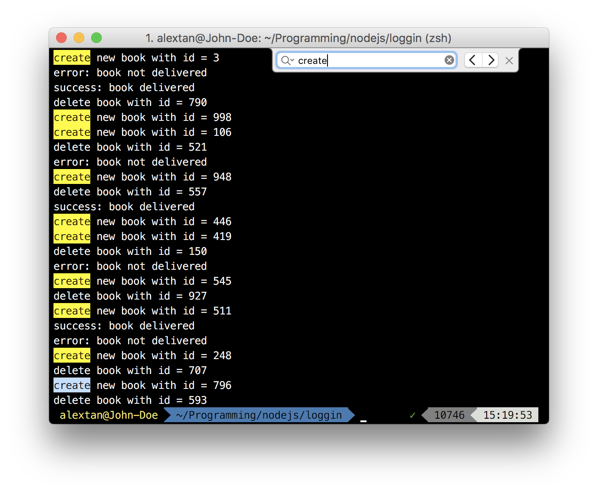
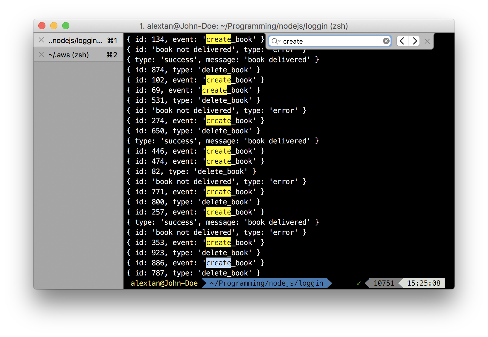

# Logging Data

How can we understand our users more (and their preferences)? In order to do that, we need data.

## Logging api calls

For each `session`, associate the user's `id` with the data they are trying to request. This is particularly useful if the api they call is one of the following:

- a search api (keywords, filters, location)
- a recommendation api (suggested places, foods. but what you really want to track is what they `click`)

Let's say the search results will return a list of foods (for simplicity, let's just take the `food_id`). From here on you can ask several questions:

1. What are the similarities between them?
2. What are user's looking for (if you have the description/category of the foods they select, you can do NLP, or similar things to identify the keywords they are most likely to look for)
3. What are the trend in keyword search? (cloudword)
4. What are the most searched foods? (positive)
5. What are the least searched foods? (negative, this is an interesting area - you probably want to look into the trend and suggest them to more relevant parties, or probably enhance them to make it more searchable. Could this be the keyword that most user's want to look for, but fail to get relevant results?).
6. What are the daily/weekly/monthly/yearly search trend?
7. How does the search relates to region/location/country?
8. Can you compute a graph to represent the relationship between the search data and user's profile?

## Tracing onboarding

You have an onboarding screen (login/complete profile) and you would like to track the likelihood they complete the profile (or where they stop, a.k.a. the `pivot point`).
There are several ways to do it, but it involves the following:

1. Determine the starting point, and if the user already enters it
2. Plan the number of steps (if you have 5 steps, each of them contributes to 20% completion)
3. Log the every successful steps, and place them in the corresponding bucket (20%-complete, 40%-complete)
4. If you can log the fields that they do not fill in, you can possibly identify the reason why.
5. As usual, log the user's context to gain more insight on what kind of users will be most likely to complete the flow.
6. Log the time for completion if necessary.

## Tracking Call-to-Actions (CTA) Buttons

A typical mistake would be to just log the event if the user click's the button. You need to log both the number of times displayed and also the feedback.

Given that you have a `Buy this Button`, you need to:

1. Log the number of times the button is displayed (n)
2. Log the actions taken (you can associate it with rewards, `reward=1` if the user clicks, `reward=0` if the user did not click)
3. Possibly the time elapsed (difference in time since display versus clicked). Here we will have an issue with delayed response, especially when the user choose not to click.
4. Compute the ratio of the reward vs number of times displayed.
5. User's context (age, gender, location, etc) is optional for in-depth personalization

So if you displayed the button 100 times, and got 35 clicks, the click ratio will be 0.35. It's up to you to justify whether this is a good value or not.

## Logging vs Monitoring

There are things we want to log (errors, business insights) and monitor (application errors, health check). You need to separate both of them, as logging errors does not add value to business. 
A developer would like to monitor the application (request api calls, errors, cpu/memory usage). 

Business and marketing are only interested to know about the analytics (what are the target audience based on gender, age, location, etc).

## Structured, Semi-structured and Unstructured Logging

There are several ways of logging data - compare the following three different implementations:

### Unstructured Logging

### Structured Logging

### Semi-structured Logging

