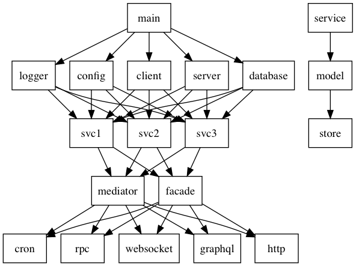

# Definition

Service takes a defined request, validates it, performs the business logic and returns the desired output.

Writing a *perfect* service can be daunting, since there are many ways requirements to fulfil. Here are some of the top requirements that I think every service will need.

- message queue
- design patterns
- configuration
  - environment variables
  - dynamic config
- store
- testing
  - integration
  - component
- performance
  - debugging
  - profiling
  - metrics gathering
- logging
  - audit logs
  - health check
  - distributed tracing
  - anomaly detection
  - report generation
- business logic
  - requirements
  - validation
  - scope
  - sla
- resiliency
  - failures
- cancellation/deadline/timeouts
- flexibility - how easy is it for your services to be consumed by different transports, be it REST, RPC/gRPC, msgpack, etc.? Or perhaps how easy it is to run it as a cron, or serverless function?
- modularity
- security
  - authentication
  - api gateway
  - rate-limiting
- deployability
  - frequency
  - features 
  - changelog
- portability - how easy is it to replicate this in different languages?
- service discovery
- scalability
  - load-balancing
  - horizontal scaling
  - vertical scaling - are your applications running out of memory or you need a larger instance to run a certain process? Before considering vertical scaling by adding more rams, memory, try profiling your application for performance bottleneck - it might save you a few hundred dollars.
- standards
  - json schema
  - json api
- documentation
  - swagger
  - protobuf IDL
  - auto-generating vs manual
  - creating a dependency graph
- versioning
  - semantic commits
  - changelog
- environment
  - development
- operations
  - ownership
  - cascading
  - Single Team Owned Service Architecture (STOSA)

## Testing

## Sample structure

Above is a simple diagram on how the code will look like. We have several layers here, from top to bottom:

- `main` is the start of the application. Is responsible for setting up dependencies, which leads us to the dependencies layer.
- Dependencies such as `logger`, `database`, `external client (http calls)`, `server`, `config` should be created at the dependency layer. Note that all these dependencies are created through factory method and are passed down through dependency injection. These configurations should be documented to inform what is required for the program to run.
- The next layer is the service layer - which is responsible for initializing services by passing the configurations and dependencies through dependency injection. Each services should be separated based on domain boundary, and should serve a purpose. In microservices architecture, it is common to have only a single service per microservice - but most of the time you need existing services to complement each other. And hence, this is a bridge between SOA and microservices, but the services are separated through packages instead of running it on different servers.
- The next layer is the orchestration layer. Here, we make use of the mediator and/or facade pattern to compose services. This is useful when you have multiple dependencies between services (e.g. you have a client service calling the oauth for google login, and need to store it to the database for another service). Note that the orchestration layer is usually an internal service.
- The most bottom layer refers to the gateway and transport layer. This is normally the layer that is either exposed to the public users (http, websocket) or a process that is running in the background (cron). Here there is a clear separation between services and transport - since only service should contain the business logic.

__Facade__ is a structural design pattern - it exposes existing functionality from a different perspective. 

__Mediator__ on the other hand is a behavioral pattern. It adds functionality because it combines different existing function to create new ones.